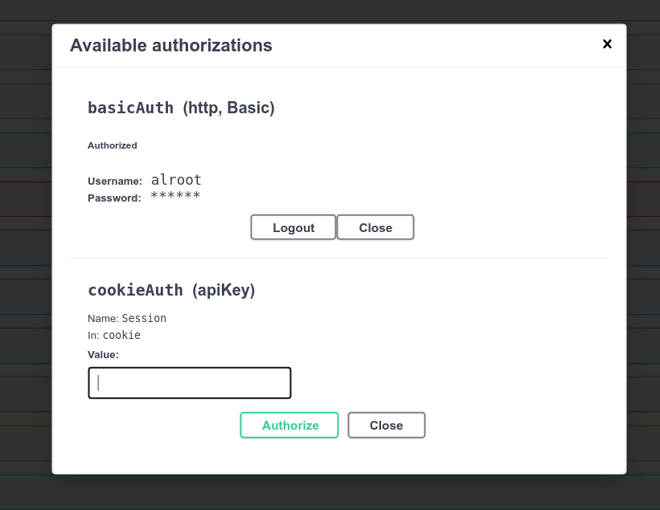
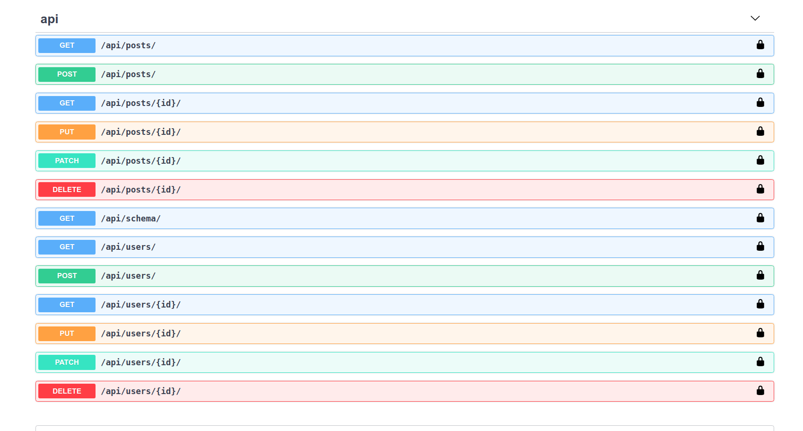
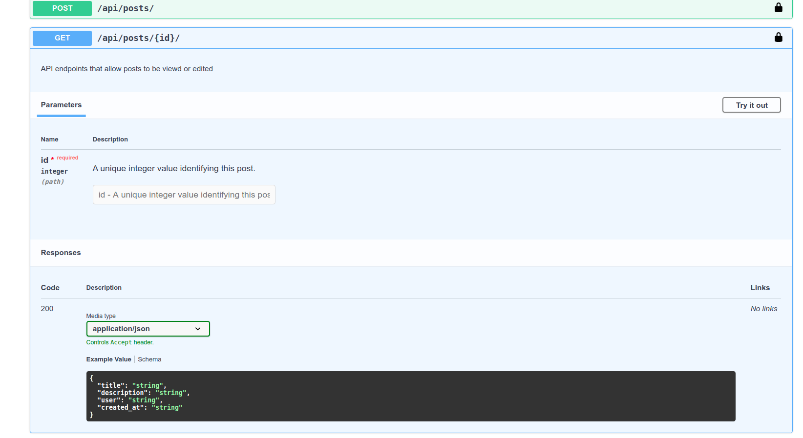

# Covid Room Finder

<table>
  <tr>
    <td></td>
</tr>

  <tr>
    <td> </td>
  </tr>
  <tr>
    <td> </td>
  </tr>
 </table>
 

## About the project
This practice project demonstrate how to use swagger to create beautiful API documentation respecting latest openAPI specifications.
 
It also demonstrate usage of containerized postgresql database in the project.

## Stacks

  - Python
  - Django
  - Docker
  - PostgreSQL
  - drf-spectacular(for swagger)
  <!-- - AJAX
  - Deployment (Heroku) -->

## Features
 - database from a docker container
 - auto generation of API docs using swagger

 

<!-- ### Live Demo
Click the link to see live demo

 -->

